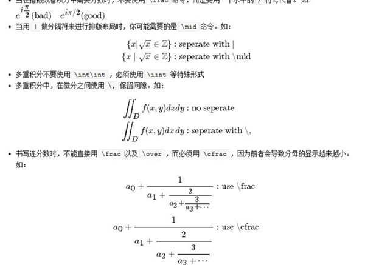

# Markdown 语法以及扩展语法（数学公式扩展、流程图扩展）

## 目标
`markdown`语法简单，非常适合做电子化笔记。本人重度记笔记，其中主要是IT类和数学类。由于`markdown`语法简单不需要考虑复杂的格式，因此使得写笔记时思维主要用于思考笔记的内容而不是格式化。
> 本人做过的所有纸质笔记可以从网盘下载：http://pan.baidu.com/s/1boxjIOZ

目前`markdown`网上教程较多，而且有些扩展语法严重依赖于编辑器。因此本人就综合现有的资料，写出了这一份文档。其中每一条命令都经过验证并给出了例子。

## 编辑器
`markdown`的扩展语法严重依赖于`markdown`编辑器。这里我采用开源的`cutemarked`编辑器。它具有以下特点：

* 完整支持`markdown`基础语法

  

* 支持`markdown`流程图扩展

  

* 支持`markdown`的数学公式扩展

  

* 支持自动提取标题以生成导航目录

  

* 支持同步转换`markdown`语法到`HTML`输出
* 支持将文档输出成`PDF`以及`HTML`格式
* 提供源代码，基于C++/Qt开源框架，可以在`Windows/Linux/MacOS`平台下编译运行

官方提供的`cutemarked`版本有一个缺陷：依赖于网络。因为它的数学公式扩展采用`MathJax`，但是它并没有将其嵌入到软件中而是通过网络下载。

本人修改了它的源码，将所需要的资源打包嵌入到软件中。这样编译生成的`cutemarked`不需要依赖网络，在离线情况下就可以完美运行。项目地址在：https://github.com/huaxz1986/markdown_documentation_chinese .
>你也可以在百度网盘下载我编译打包好的版本（解压缩直接双击运行即可），地址：http://pan.baidu.com/s/1hsATVqk ,运行环境为 Win7 64bit Professional

**本文档仅用于个人学习目的，未经许可不得用于商业目的，转载请注明出处**

**email: huaxz1986@163.com** 

